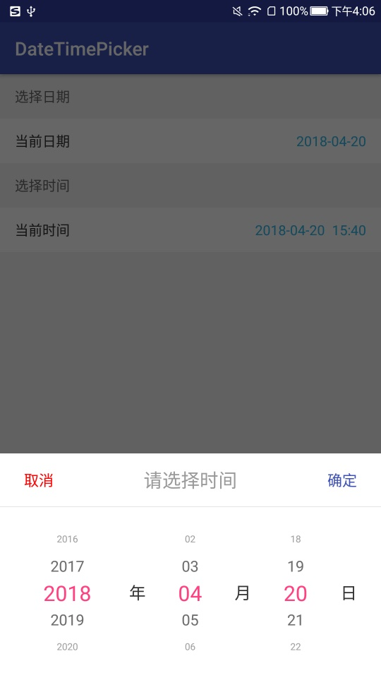
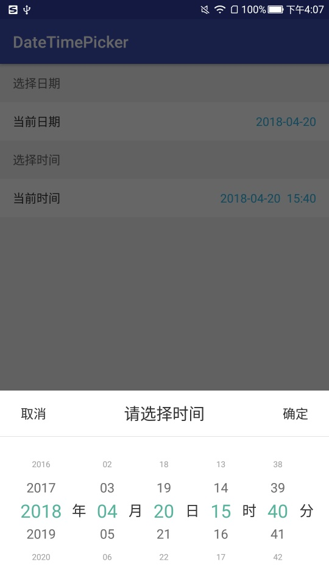

# DOCUMENT

## Screenshot

## Usage

## Parameters
[DateTimePicker.Builder](../DateTimePickerLibrary/src/main/java/jsc/lib/datetimepicker/widget/DateTimePicker.java)'s parameters:

| name | method | meaning |
| :--- | :--- | :--- |
| title | setTitle(CharSequence title) | 标题 |
| cancel | setCancel(CharSequence cancel)| 取消 |
| ok | setOk(CharSequence ok) | 确定 |
| year | setYear(CharSequence year) | 年 |
| month | setMonth(CharSequence month) | 月 |
| day | setDay(CharSequence day) | 日 |
| hour | setHour(CharSequence hour) | 时 |
| minute | setMinute(CharSequence minute) | 分 |
| titleTextColor | setTitleTextColor(@ColorInt int titleTextColor) | 标题颜色 |
| cancelTextColor | setCancelTextColor(@ColorInt int cancelTextColor) | 取消按钮颜色 |
| okTextColor | setOkTextColor(@ColorInt int okTextColor) | 确定按钮颜色 |
| yearLabelTextColor | setYearLabelTextColor(@ColorInt int yearLabelTextColor) | “年”文字颜色 |
| monthLabelTextColor | setMonthLabelTextColor(@ColorInt int monthLabelTextColor) | “月”文字颜色 |
| dayLabelTextColor | setDayLabelTextColor(@ColorInt int dayLabelTextColor) | “日”文字颜色 |
| hourLabelTextColor | setHourLabelTextColor(@ColorInt int hourLabelTextColor) |  “时”文字颜色|
| minuteLabelTextColor | setMinuteLabelTextColor(@ColorInt int minuteLabelTextColor) | “分”文字颜色 |
| textColor | setTextColor(@ColorInt int textColor) | 未选中的文字颜色 |
| selectedTextColor | setSelectedTextColor(@ColorInt int selectedTextColor) | 选中的文字颜色 |
| headerBackgroundColor | setHeaderBackgroundColor(@ColorInt int headerBackgroundColor) | 标题部分背景颜色 |
| bodyBackgroundColor | setBodyBackgroundColor(@ColorInt int bodyBackgroundColor) | 日期时间部分背景颜色 |
| segmentingLineColor | setSegmentingLineColor(@ColorInt int segmentingLineColor) | 标题部分与日期时间部分分割线颜色 |
| segmentingLineHeight | setSegmentingLineHeight(@IntRange(from = 1) int segmentingLineHeight) | 标题部分与日期时间部分分割线高度 |