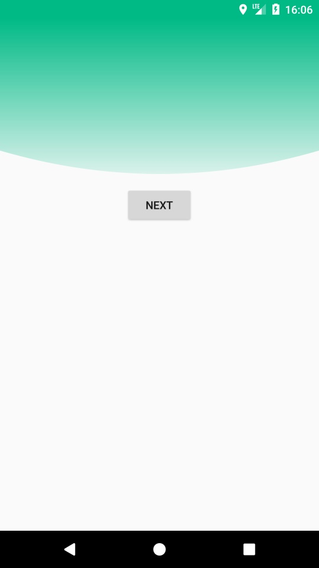
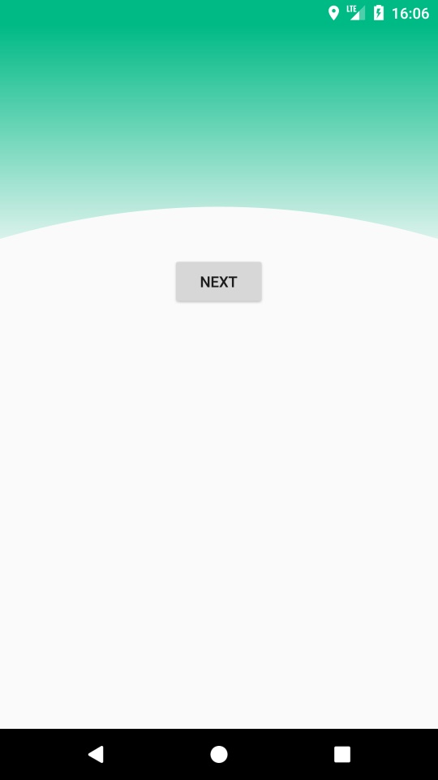
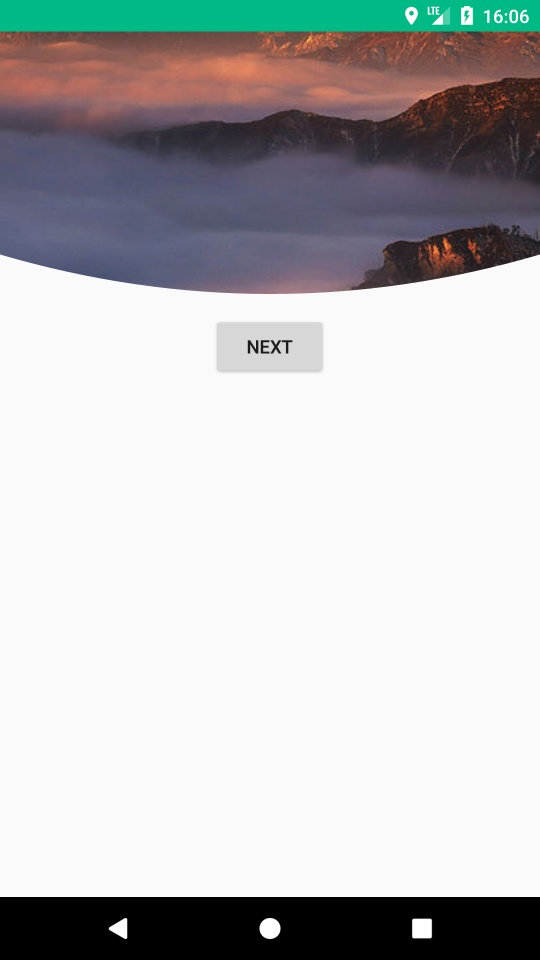
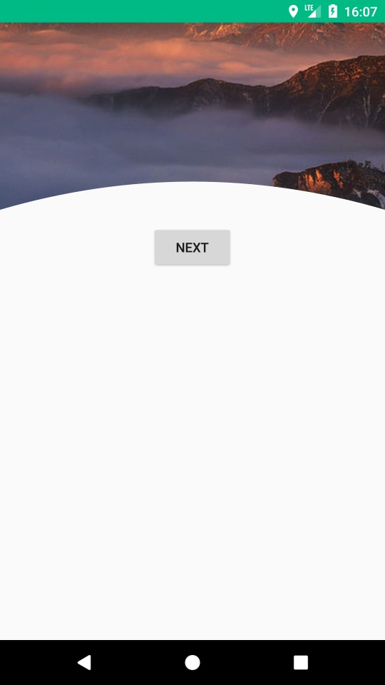

# ArcHeaderView、ArcHeaderDrawable

## Screenshot





## Link
[ArcHeaderDrawable](../library/src/main/java/jsc/kit/archeaderview/ArcHeaderDrawable.java)  
[LGradientArcHeaderView](../library/src/main/java/jsc/kit/archeaderview/LGradientArcHeaderView.java)  
[PictureArcHeaderView](../library/src/main/java/jsc/kit/archeaderview/PictureArcHeaderView.java)

## Attributions
`xmlns:app="http://schemas.android.com/apk/res-auto"`

| 参数 | 类型 | 含义 |
|:---|:---|:---|
| app:ahv_height | dimension | 弧形高度，默认为`0px` |
| app:ahv_direction | enum | 弧形方向：`downOutSide`向下、`downInSide`向上，默认为`downOutSide` |
| app:ahv_start_color | color | LGradientArcHeaderView渐变开始颜色，默认为`0xFFFF3A80` |
| app:ahv_end_color | color | LGradientArcHeaderView渐变结束颜色，默认为`0xFFFF3745` |
| app:ahv_src | resource | PictureArcHeaderView图片资源id |

## Usage
```
        <jsc.kit.archeaderview.LGradientArcHeaderView
            android:id="@+id/lg_header_view"
            android:layout_width="match_parent"
            android:layout_height="match_parent"
            app:ahv_end_color="#3300BA86"
            app:ahv_start_color="#FF00BA86"
            app:ahv_height="30dp" />

        <jsc.kit.archeaderview.PictureArcHeaderView
            android:id="@+id/p_header_view"
            android:layout_width="match_parent"
            android:layout_height="match_parent"
            app:ahv_src="@drawable/header"
            app:ahv_height="30dp"
            app:ahv_direction="downInSide" />
```