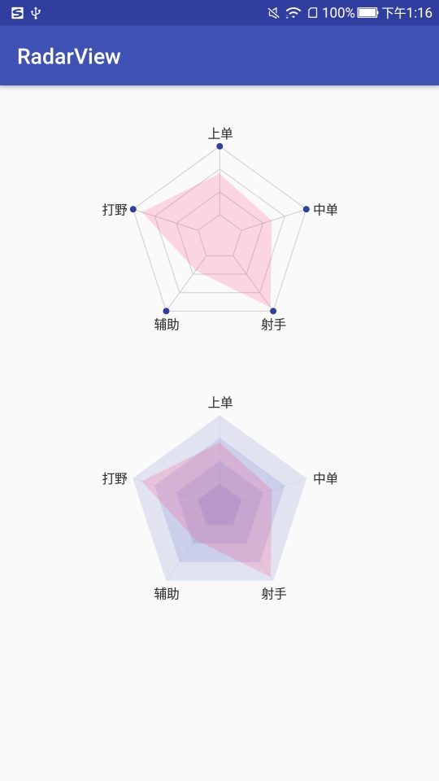

# RadarView

## Screenshot


## Link
[**RadarView**](../library/src/main/java/jsc/kit/radarview)

## Attributions
`xmlns:app="http://schemas.android.com/apk/res-auto"`

| 参数 | 类型 | 含义 |
|:---:|:---|:---|
| app:rv_start_angle | int | 偏移角度，默认为`0` |
| app:rv_layer_count | int | 多边形层数，默认为`4` |
| app:rv_layer_style | enum | 多边形填充模式：`stroke`、`fill`，默认为`stroke` |
| app:rv_layer_color | color | 多边形填充颜色， 默认为`0xFFCCCCCC` |
| app:rv_layer_stroke_width | dimension | 多边形画笔粗细，默认为`1px` |
| app:rv_output_color | dimension | 数据图层颜色，默认为`0x66FF4081` |
| app:rv_vertex_show | boolean | 是否显示最外层多边形顶点，默认为`false` |
| app:rv_vertex_color | color | 最外层多边形顶点颜色，默认为`Color.CYAN` |
| app:rv_vertex_radius | dimension | 最外层多边形顶点半径，默认为`8px` |

## Usage
```
<?xml version="1.0" encoding="utf-8"?>
<LinearLayout xmlns:android="http://schemas.android.com/apk/res/android"
    xmlns:app="http://schemas.android.com/apk/res-auto"
    android:layout_width="match_parent"
    android:layout_height="match_parent"
    android:orientation="vertical">

    <jsc.kit.radarview.RadarView
        android:id="@+id/radar_view1"
        android:layout_width="220dp"
        android:layout_height="wrap_content"
        android:layout_gravity="center_horizontal"
        android:layout_marginTop="32dp"
        android:padding="24dp"
        app:rv_layer_color="#ccc"
        app:rv_layer_count="4"
        app:rv_layer_stroke_width="2px"
        app:rv_layer_style="stroke"
        app:rv_output_color="#33FF4081"
        app:rv_start_angle="-18"
        app:rv_vertex_color="@color/colorPrimaryDark"
        app:rv_vertex_radius="3dp"
        app:rv_vertex_show="true" />

    <jsc.kit.radarview.RadarView
        android:id="@+id/radar_view2"
        android:layout_width="220dp"
        android:layout_height="wrap_content"
        android:layout_gravity="center_horizontal"
        android:layout_marginTop="32dp"
        android:padding="24dp"
        app:rv_layer_color="#223F51B5"
        app:rv_layer_count="4"
        app:rv_layer_style="fill"
        app:rv_output_color="#33FF4081"
        app:rv_start_angle="-18" />

</LinearLayout>
```
```
        RadarView radarView1 = findViewById(R.id.radar_view1);
        RadarView radarView2 = findViewById(R.id.radar_view2);
        String[] labels = new String[]{"中单", "射手", "辅助", "打野", "上单"};
        float[] data = new float[]{0.6f, 0.95f, 0.45f, 0.9f, 0.7f};
        int[] align = new int[]{RadarEntity.ALIGN_RIGHT, RadarEntity.ALIGN_BOTTOM, RadarEntity.ALIGN_BOTTOM, RadarEntity.ALIGN_LEFT, RadarEntity.ALIGN_TOP};
        List<RadarEntity> entities = new ArrayList<>();
        for (int i = 0; i < data.length; i++) {
            RadarEntity entity = new RadarEntity();
            entity.setLabel(labels[i]);
            entity.setValue(data[i]);
            entity.setLabelAlignType(align[i]);
            entities.add(entity);
        }
        radarView1.setRadarEntities(entities);
        radarView2.setRadarEntities(entities);
```